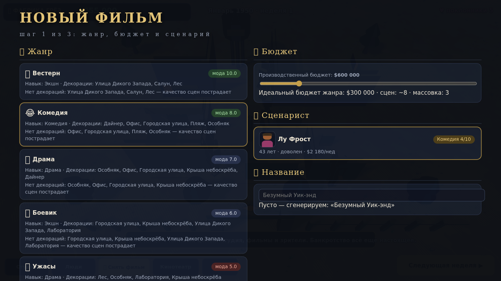
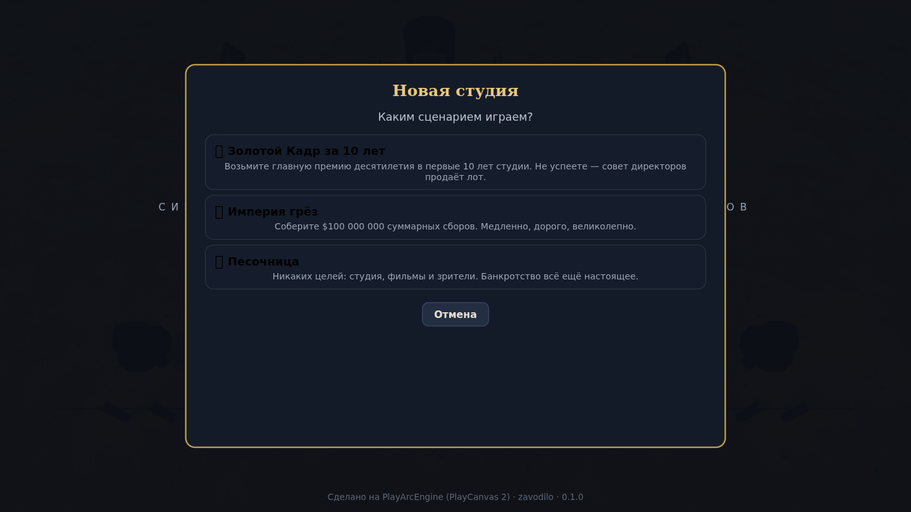
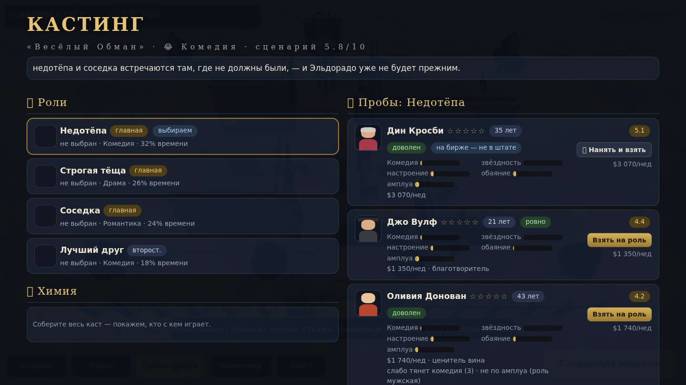
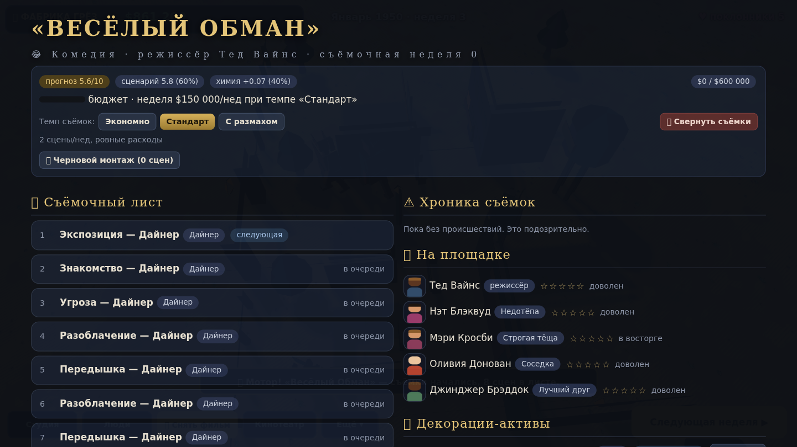
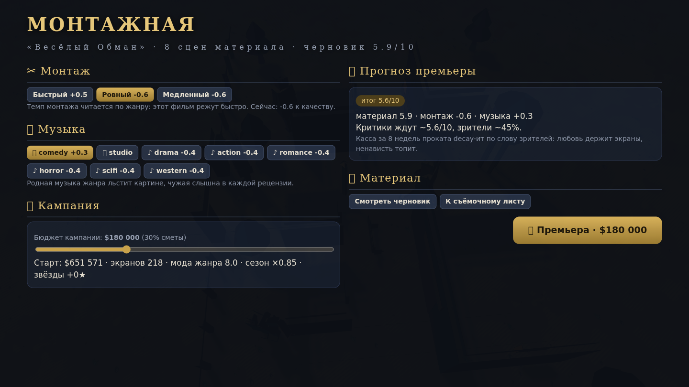
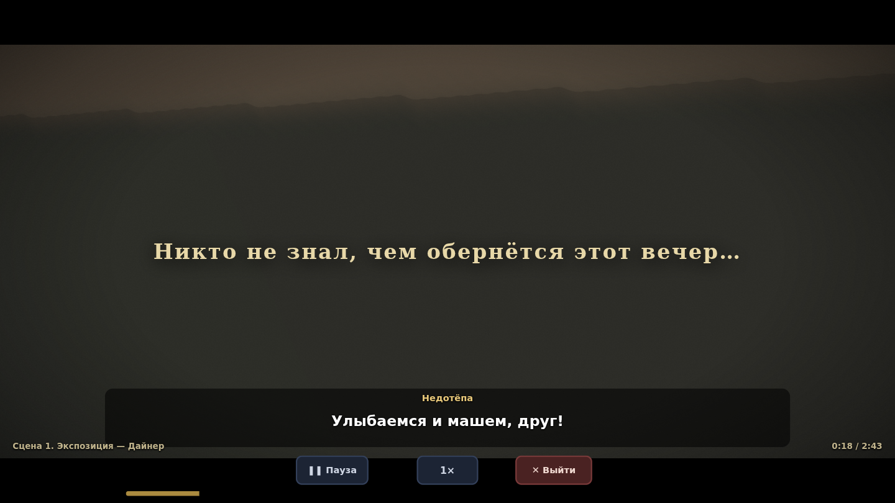
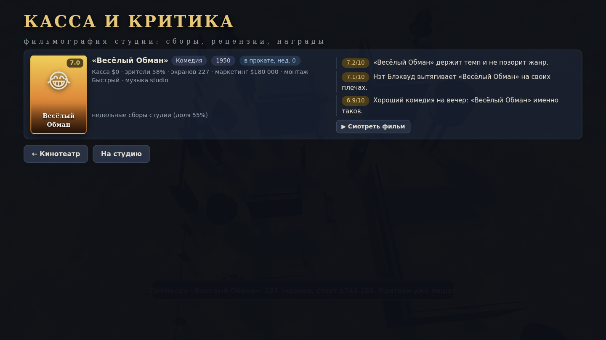
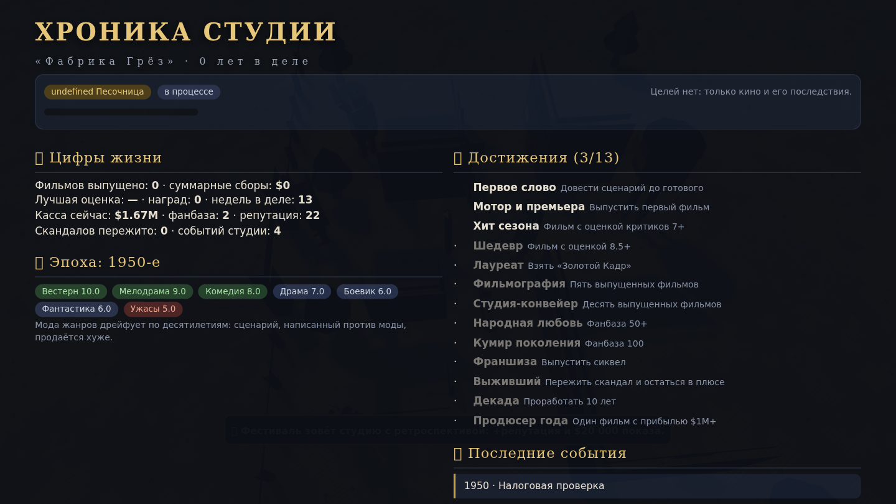

# 🎬 ФАБРИКА ГРЁЗ

**▶ Играть прямо в браузере: [zavodilo.github.io/FabrikaGrez](https://zavodilo.github.io/FabrikaGrez/)**
(GitHub Pages, сборка 1.0.0; публикация — `node tools/deploy-pages.mjs`, она же smoke-тестит живой сайт)

**Симулятор киностудии в духе *The Movies*, где главный спецэффект — это ваш собственный фильм.**
Вы ведёте студию с 1950 года: деньги, люди, декорации, сценарии, съёмки, прокат, награды —
а потом **садитесь в зале и смотрите картину, которую сняли**: с камерами, склейками,
субтитрами, музыкой и титрами. Всё сгенерировано из ваших решений, в 3D, прямо в браузере.

Сделано на [PlayArcEngine](https://github.com/zavodilo/PlayArcEngine) (PlayCanvas 2, toon-рендер):
ванильный JS, классические `<script>`, **ноль npm-зависимостей и ноль шага сборки** у самой игры.



---

## Как запустить

```bash
node tools/arc.mjs run        # игра на http://localhost:8080 (или следующий свободный порт)
node tools/arc.mjs editor     # редактор набора на http://localhost:8090/_utils/editor/
node tools/arc.mjs check      # типы + тесты + синхронность скиллов + манифест
node tools/arc.mjs check --all# релизный гейт: + headless-рендер и визуальный дым
node tools/arc.mjs build      # dist/arcengine-<version>.zip — играбельно без репозитория
node tools/deploy-pages.mjs   # собрать и опубликовать на GitHub Pages + smoke-тест живого сайта
```

Нужен только Node.js (любой современный LTS) для инструментов; **игре он не нужен** —
откройте `index.html` через любой статический сервер, и она работает.

## Игровой цикл

| Шаг | Экран | Что происходит |
|---|---|---|
| 1. Студия | `Студия` | Деньги, фанбаза, репутация, хроника; покупка и **перестройка декораций** (активы с уровнями) |
| 2. Сценарий | `Снять фильм` | Жанр с «модой» по эпохам, бюджет, сценарист, название, сиквелы; заказ за деньги и недели или «на коленке» |
| 3. Читалка | `Фильмы → Читать` | Три акта, сцены по декорациям, RU-диалоги без повторов; **дневники съёмок по каждой сцене** |
| 4. Кастинг | `Кастинг` | Скоринг ролей из пяти весов с объяснением, химия пар, авто-кастинг, найм с биржи |
| 5. Съёмки | `Производство` | Недели смен, броски качества по строкам, темп, инциденты, черновой монтаж |
| 6. Монтажная | `Монтажная` | Темп монтажа по жанру, музыка, кампания со прогнозом старта по строкам |
| 7. Прокат | `Касса и критика` | 8 недель сборов с decay по слову зрителей, рецензии с цитатами, постеры, прибыль |
| 8. Зал | `Кинотеатр` | **Смотреть свой фильм**: камеры, склейки, субтитры, музыка, титры |

**9 жанров** (вестерн, комедия, драма, боевик, ужасы, фантастика, мелодрама, нуар, мюзикл)
и **14 декораций** (от улицы Дикого Запада до ночного клуба и вокзала) — каждый жанр со своей
музыкой, пулом реплик, модой по эпохам и листом ролей.

Плюс: контракты и переманивание звёзд, дружба/романы/соперничество со скандалами,
школа мастерства, старение и пенсии, события студии, дрейф десятилетий, франшизы,
«Золотой Кадр» раз в год, три сценария игры («Золотой Кадр за 10 лет», «Империя грёз», песочница),
13 достижений, автосохранение + 3 слота + экспорт/импорт `.json`.

## Управление

- **Мышь**: все экраны — карточки и кнопки; колесо — зум студии; ПКМ — осмотреться; WASD/QE — полёт камеры.
- **В кино**: `Пробел` — пауза, `Esc` — выйти, кнопки темпа и перемотки внизу.
- **Неделя**: кнопка «Следующая неделя ▶» (или авто-неделя в настройках на экране «Ещё»).

## Галерея

| | |
|---|---|
|  |  |
|  |  |
|  |  |
|  |  |

## Как это устроено

- **`js/MovieSequencer.js`** — плеер таймлайна: сцены → кадры → beats (действия, реплики, SFX, позы
  камер). Один и тот же плеер показывает демо-фильм, дневники, черновой монтаж и релиз.
- **`js/ScriptGenerator.js`** — сценарии и **компиляция сценарий+каст → таймлайн**: встречная
  постановка актёров, операторский кран с решёнными позами (интерьеры снимаются «кукольным
  домиком», улица — с открытых сторон), киношные дистанции и трёхчетвертные крупные.
- **`js/ActorRig3D.js` / `js/SetPieces3D.js`** — процедурные актёры (19 действий) и 12 декораций
  с реквизитом: внешность и площадки существуют без единого ассета-модели.
- **`js/StudioManager.js`, `PeopleSystem.js`, `ProductionSystem.js`, `ReleaseSystem.js`,
  `MetaSystem.js`, `SaveSystem.js`, `Tutorial.js`** — экономика, люди, съёмки, прокат,
  мета-игра, сохранения и обучение. Вся логика — чистые данные на детерминированном `Rng`:
  фильм воспроизводим из seed байт-в-байт.
- **Инварианты набора**: числа только в `Constants.js` (редактируются редактором), HUD только
  через `UILayout.js`, 3D — это вид (логика не спрашивает у рендера высоты), ассеты литералами.

## Проверка

Релиз держится на трёх контурах, а не на вере:

1. `node tools/check.mjs` — **170+ тестов**: контракты таймлайна для всех жанров и бюджетов,
   детерминизм seed, экономика, инциденты, химия, франшизы, сохранения; типы игры и редактора;
   синхронность скиллов и манифест констант.
2. `node tools/verify-gameplay.mjs` — **сквозной прогон в headless-Chrome**: от выбора сценария
   игры до просмотра выпущенного фильма, ~60 проверок, включая «фильм проигран целиком»,
   «субтитры идут», «актёры двигаются», «ни одной ошибки консоли».
3. `node tools/balance-sim` (тест `tests/fabrika-balance.test.mjs`) — продюсерская политика
   ведёт студию **20 лет на 10 разных seed**: без NaN, без банкротства, с растущей фильмографией.
4. `node tools/capture-stills.mjs` — контактные листы по жанрам: способ *смотреть* на операторскую
   работу, а не верить ей на слово.

Именно прогон в браузере нашёл релиз-блокеры, невидимые юнит-тестам: декорации не строились
(плеер падал на первой сцене), фильм застревал на заставке, UI рендерился нестилизованым.

## Баланс в одном абзаце

Труппа стоит ~10–25k в неделю; фильм живёт ~11 недель от заказа до премьеры; старт кассы =
фанаты × 1200 + качество × 90 000, умноженные на кампанию, звёзд, моду жанра, сезон, франшизу
и **производственную ценность** (деньги на экране продают билеты). Прокат decay-ит по слову
зрителей: любовь держит экраны, ненависть топит. Хит приносит ~0.5–1.5M прибыли, провал — убыток;
налог и инциденты ограничены, чтобы успех не становился наказанием.

## Лицензия и благодарности

MIT (см. `LICENSE`, `NOTICE`). Движок — PlayCanvas 2 (libs/, локально) и PlayArcEngine.
